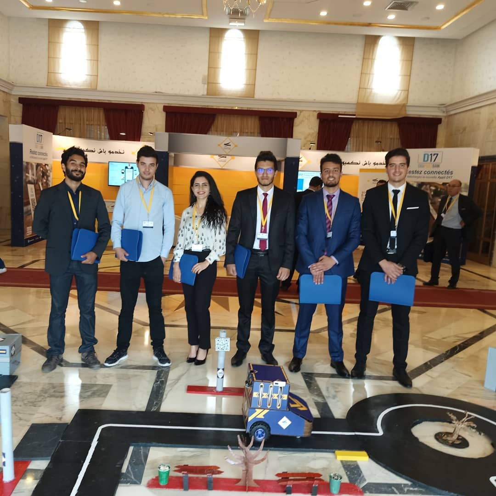
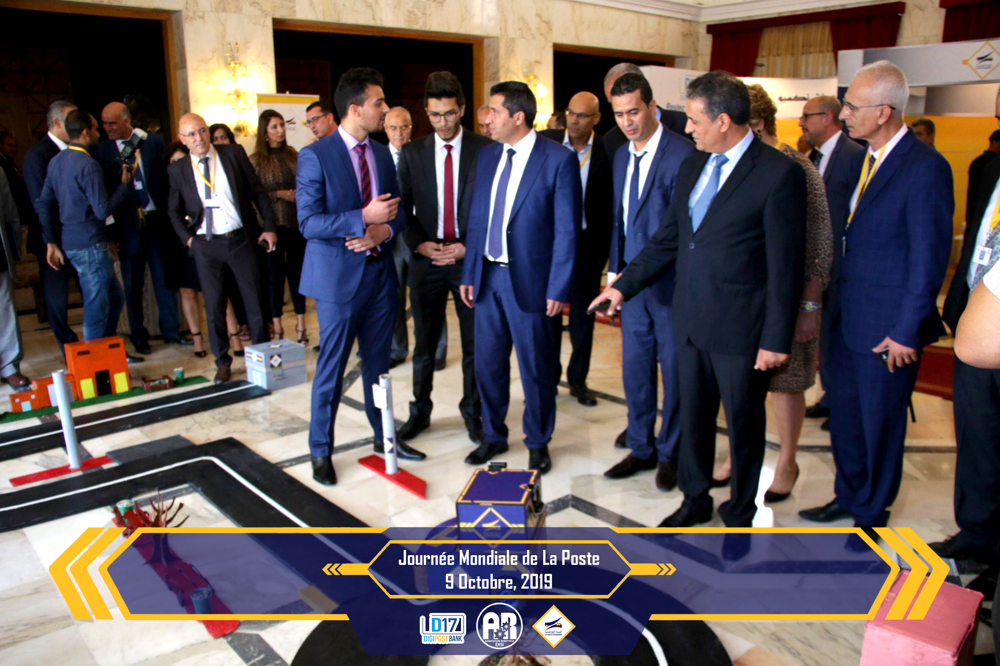

# Post Robot

This project is in collaboration with the Tunisian Post it is an autonomous and intelligent robot delivering parcels. It is guided by two cameras one for recognizing the path and the other for reading the QR code.
The presentation is made during World Post Day in the presence of the Minister of Technology.

✅ Keywords: Raspberry Pi 	3, Arduino, Python, C/C++, OpenCV, Image Segmentation, Gear system.

Demo: https://www.youtube.com/watch?v=dV-r053dy6c

